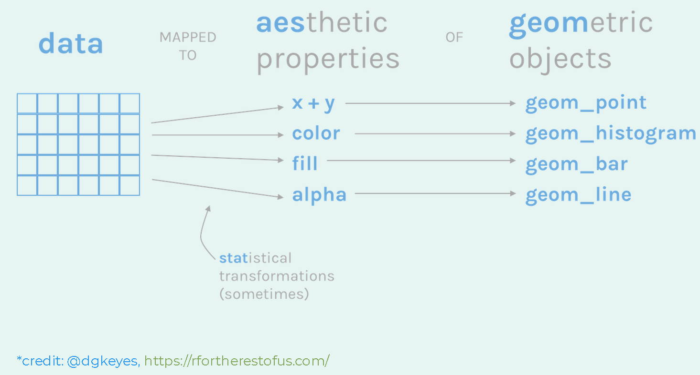

```{r setup, include=FALSE}
knitr::opts_chunk$set(echo = FALSE)
```
```{r}
options(tinytex.verbose = TRUE)
```


# Load libraries
```{r}
suppressPackageStartupMessages(library(tidyverse))
suppressPackageStartupMessages(library(gapminder))
suppressPackageStartupMessages(library(skimr))
suppressPackageStartupMessages(library(knitr))
suppressPackageStartupMessages(library(kableExtra))
```


# Load data

> An excerpt of the data available at Gapminder.org. For each of 142 countries, the package provides values for life expectancy, GDP per capita, and population, every five years, from 1952 to 2007.

```{r}
data("gapminder")
```
  
  

<iframe width="700" height="500" src="https://www.youtube.com/embed/hVimVzgtD6w?start=190" frameborder="0" allow="accelerometer; autoplay; encrypted-media; gyroscope; picture-in-picture" allowfullscreen></iframe>    


# Exploratory Data Analysis
## Data structure
```{r}
glimpse(gapminder)
```
  
**First 10 rows**
```{r, }
kable(gapminder %>% head(10)) %>%
  kable_styling("striped", full_width = F) 
```

```{r}
skim(gapminder)
```

# Using ggplot2 library for plotting

> ggplot2 is the name of a library in R language that is used for plotting. It is a part of the `tidyverse` library that contains other libraries for *tidy* data analysis.

When we ran `library(tidyverse)`, the `ggplot2` library was also loaded. If we only want to load `ggplot2`, we can do so:

```{r}
library(ggplot2)
```


## Filtering the `gapminder` data for **Canada**

**Pseudo code**
1. Take the gapminder data *AND THEN*
2. Filter out all the data except for Canada  

**R code**
```{r}
canada = gapminder %>% 
  filter(country == "Canada")

canada
```


  


   

   

## Plotting population over years

**data**
```{r}
ggplot(data = canada)
```


**data and aesthetics**
```{r}
ggplot(data = canada,
       mapping = aes(x = year, y = pop))
```

**data, aesthetics and geometric object**
```{r}
ggplot(data = canada,
       mapping = aes(x = year, y = pop)) +
  geom_point()
```


> YOUR TURN: Create a new data set for your favorite country and plot its population over years   

```{r, eval=FALSE}
my_country <- gapminder %>% 
  filter(country == "Thailand")


ggplot(data = my_country,
       mapping = aes(x = year, y = pop)) +
  geom_point()
```


## Color

### Numeric

```{r}
ggplot(data = canada,
       mapping = aes(x = year, y = pop, color = lifeExp)) +
  geom_point()
```

### Categories

```{r}
ggplot(data = canada,
       mapping = aes(x = year, y = pop, color = as.factor(year))) +
  geom_point()
```


## Size

```{r}
ggplot(data = canada,
       mapping = aes(x = year, y = pop, size = lifeExp)) +
  geom_point()
```


## Shape (Not great for > 3 categories)

```{r}
ggplot(data = canada,
       mapping = aes(x = year, y = pop, shape = as.factor(year))) +
  geom_point()
```


## What if you use all?
```{r}
ggplot(data = canada,
       mapping = aes(x = year, y = pop, size = lifeExp), color = I("red")) +
  geom_point()
```


   


   


## Line
```{r}
ggplot(data = canada,
       mapping = aes(x = year, y = pop)) +
  geom_line()
```


## Histogram

Now using the compete `gapminder` data:
```{r}
ggplot(data = gapminder,
       mapping = aes(x = lifeExp)) +
  geom_histogram()
```


### fill color

```{r}
ggplot(data = gapminder,
       mapping = aes(x = lifeExp, fill = continent)) +
  geom_histogram()
```

**add transparency**
```{r}
ggplot(data = gapminder,
       mapping = aes(x = lifeExp, fill = continent, alpha = 0.6)) +
  geom_histogram()
```


## Boxplot
```{r}
ggplot(data = gapminder,
       mapping = aes(x = continent, y = lifeExp)) +
  geom_boxplot()
```


## Creating a scatter plot for all countries

Now we'll use the complete `gapminder` data
```{r}
ggplot(data = gapminder,
       mapping = aes(x = year, y = pop)) +
  geom_point()
```


> YOUR TURN: Copy the above code and paste it below. Replace `year` with `gdpPercap`    

```{r}

```

  

**Colour the continents**
```{r}
ggplot(data = gapminder,
       mapping = aes(x = year, y = pop, color = continent)) +
  geom_point()
```


> YOUR TURN: Copy the above code and paste in the R chunk below. Then change `color`to `size` and run it.  

```{r}

```


**Separate the continents using `facets`**
```{r, fig.width=10}
ggplot(data = gapminder,
       mapping = aes(x = year, y = pop, color = continent)) +
  geom_point() +
  facet_wrap(~ continent)
```

**Change scales**
```{r, fig.width=10}
ggplot(data = gapminder,
       mapping = aes(x = year, y = pop, color = continent)) +
  geom_point() +
  facet_wrap(~ continent, scales = "free_y")
```

**Can we create a facet for each country?**
> YES  

```{r, fig.width=15, fig.height=15}
ggplot(data = gapminder,
       mapping = aes(x = year, y = pop)) +
  geom_point() +
  facet_wrap(~ country)
```

    


> YOUR TURN: Create a facted plot for each `year`. Use `x = gdpPercap`, `y = lifeExp` and `color = continent`. You can use the above code to start.    

```{r}

```


```{r, fig.width=18, fig.height=8}
ggplot(data = gapminder %>% filter(continent %in% c("Oceania", "Asia")),
       mapping = aes(x = country, y = lifeExp, fill = continent)) +
  geom_boxplot() +
  facet_wrap(~continent)
```


# Transforming a distribution

## Original
```{r}
ggplot(data = gapminder,
       mapping = aes(x = gdpPercap)) +
  geom_histogram() 
```


## Transformed
```{r}
ggplot(data = gapminder,
       mapping = aes(x = gdpPercap)) +
  geom_histogram() +
  scale_x_log10()
```

# Plotting a linear model for Canada
```{r}
ggplot(data = canada,
       mapping = aes(x = year, y = pop)) +
  geom_point() +
  geom_smooth(method = "lm")
```


### Let's try 1 continent (`Americas`)
```{r}
gapminder %>% pull(continent) %>% unique()
```

**Create a dataframe for Americas**
```{r}
americas <- gapminder %>% 
  filter(continent == "Americas")
```

**Plot**
```{r, fig.width=15, fig.height=10}
ggplot(data = americas,
       mapping = aes(x = year, y = pop)) +
  geom_point() +
  geom_smooth(method = "lm") +
  facet_wrap(~ country, scale = "free_y")
```

> YOUR TURN: Do a similar plot like above for `Oceania`  

```{r}

```


> YOUR TURN: Using the 2007 data set (created below), plot the life expectancy as a function of GDP. Color each continent and also use `size = pop`.  

**Data**
```{r}
all_countries_2007 <- gapminder %>% 
  filter(year == 2007)
```

**Plot**  
```{r, eval=FALSE}
 ggplot(data = ---,
        mapping = aes(x = ---, y = ---, color = ---, size = ---)) +
     geom_point() 
```


# Improving plot step-by-step

## plot everything
```{r, fig.width=15, fig.height=10}
ggplot(gapminder, aes(gdpPercap, lifeExp, size = pop)) +
  geom_point()
```

## increase point transparency
```{r, fig.width=15, fig.height=10}
ggplot(gapminder, aes(gdpPercap, lifeExp, size = pop)) +
  geom_point(alpha = 0.4)
```


## add color
```{r, fig.width=15, fig.height=10}
ggplot(gapminder, aes(gdpPercap, lifeExp, size = pop, color = continent)) +
  geom_point(alpha = 0.4)
```

## transform
```{r, fig.width=15, fig.height=10}
ggplot(gapminder, aes(gdpPercap, lifeExp, size = pop, color = continent)) +
  geom_point(alpha = 0.4) +
  scale_x_log10() 
```

## facet by year
```{r, fig.width=15, fig.height=10}
ggplot(gapminder, aes(gdpPercap, lifeExp, size = pop, color = continent)) +
  geom_point(alpha = 0.4) +
  scale_x_log10() +
  facet_wrap(~ year)
```


## improve point size
```{r, fig.width=15, fig.height=10}
ggplot(gapminder, aes(gdpPercap, lifeExp, size = pop, color = continent)) +
  geom_point(alpha = 0.4) +
  scale_x_log10() +
  scale_size(range = c(2, 12)) +
  facet_wrap(~ year)
```

## labels
```{r, fig.width=15, fig.height=10}
ggplot(gapminder, aes(gdpPercap, lifeExp, size = pop, color = continent)) +
  geom_point(alpha = 0.4) +
  geom_text(aes(label = country)) +
  scale_x_log10() +
  scale_size(range = c(2, 12)) +
  facet_wrap(~ year)
```


```{r}
gapminder %>% filter(year == 1952)
```


## create data for labels
```{r}
selected_countries <- gapminder %>% 
  filter(country %in% c("China", "India", "United States"))
```

### plot
```{r, fig.width=15, fig.height=10}
ggplot(gapminder) +
  geom_point(aes(gdpPercap, lifeExp, size = pop, color = continent), alpha = 0.4) +
  geom_text(data = selected_countries, aes(gdpPercap, lifeExp, label = country)) +
  scale_x_log10() +
  scale_size(range = c(2, 12)) +
  facet_wrap(~ year)
```


### plot (with ggrepel)
```{r, fig.width=15, fig.height=10}
library(ggrepel)


ggplot(gapminder) +
  geom_point(aes(gdpPercap, lifeExp, size = pop, color = continent), alpha = 0.4) +
  geom_text_repel(data = selected_countries, 
                  aes(gdpPercap, lifeExp, label = country), 
    box.padding = unit(0.35, "lines"),
    point.padding = unit(0.3, "lines")) +
  scale_x_log10() +
  scale_size(range = c(2, 12)) +
  facet_wrap(~ year)
```


# Cleaning up plot

## add axis labels and title
```{r, fig.width=15, fig.height=10}
ggplot(gapminder) +
  geom_point(aes(gdpPercap, lifeExp, size = pop, color = continent), alpha = 0.4) +
  # geom_text_repel(data = selected_countries, 
  #                 aes(gdpPercap, lifeExp, label = country), 
  #   box.padding = unit(0.35, "lines"),
  #   point.padding = unit(0.3, "lines")) +
  scale_x_log10() +
  scale_size(range = c(2, 12)) +
  facet_wrap(~ year) +
  labs(title = "GDP versus Life-expectancy", 
       x = "GDP per capita",
       y = "Life-expectancy (yrs)")
```

## default themes
```{r, fig.width=15, fig.height=10}
ggplot(gapminder) +
  geom_point(aes(gdpPercap, lifeExp, size = pop, color = continent), alpha = 0.4) +
  # geom_text_repel(data = selected_countries, 
  #                 aes(gdpPercap, lifeExp, label = country), 
  #   box.padding = unit(0.35, "lines"),
  #   point.padding = unit(0.3, "lines")) +
  scale_x_log10() +
  scale_size(range = c(2, 12)) +
  facet_wrap(~ year) +
  labs(title = "GDP versus Life-expectancy", 
       x = "GDP per capita",
       y = "Life-expectancy (yrs)") +
  theme_minimal()
```

```{r, fig.width=15, fig.height=10}
final_plot <- ggplot(gapminder) +
  geom_point(aes(gdpPercap, lifeExp, size = pop, color = continent), alpha = 0.4) +
  geom_text_repel(data = selected_countries, 
                  aes(gdpPercap, lifeExp, label = country), 
    box.padding = unit(0.35, "lines"),
    point.padding = unit(0.3, "lines")) +
  scale_x_log10() +
  scale_size(range = c(2, 12)) +
  facet_wrap(~ year) +
  labs(title = "GDP versus Life-expectancy", 
       x = "GDP per capita",
       y = "Life-expectancy (yrs)") +
  theme_bw()

final_plot
```


## save plot
```{r, eval=FALSE}
ggsave(filename = "final_plot.png", plot = final_plot, path = "figures/", dpi = 400, width = 11, height = 8, units = "in")
```


# Bonus: Animation 
```{r, eval=FALSE}
library(gganimate)

ggplot(gapminder, aes(gdpPercap, lifeExp, size = pop, colour = country)) +
  geom_point(alpha = 0.7) +
  scale_size(range = c(2, 12)) +
  scale_x_log10() +
  facet_wrap(~continent) +
  theme(legend.position = 'none') +
  labs(title = 'Year: {frame_time}', x = 'GDP per capita', y = 'life expectancy') +
  transition_time(year) +
ease_aes('linear')
```

